### 点击小图标可跳转至ICNS原图  /  Click on the thumbnail to access the ICNS file  
当前共有 [153] 个图标 / Here are [153] icons now  
****  

<a href="../icons/1Password.icns">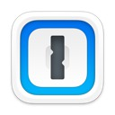</a>

<a href="../icons/AirServer.icns">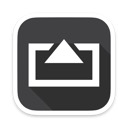</a>

<a href="../icons/BaiduNetdisk.icns">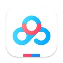</a>
<a href="../icons/BattleNet.icns">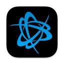</a>

<a href="../icons/BitBar.icns">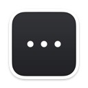</a>

<a href="../icons/Blocs.icns">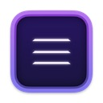</a>
<a href="../icons/BlueStacks.icns">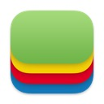</a>
<a href="../icons/Boom3D.icns">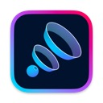</a>
<a href="../icons/CAJViewer.icns">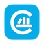</a>

<a href="../icons/Charles.icns">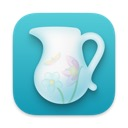</a>
<a href="../icons/Chrome(1).icns">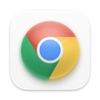</a>
<a href="../icons/Chrome(2).icns">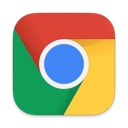</a>

<a href="../icons/CleanMyMac.icns">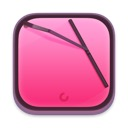</a>
<a href="../icons/CloverConfigurator.icns">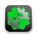</a>
<a href="../icons/CodeRunner.icns">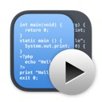</a>

<a href="../icons/DaVinci.icns">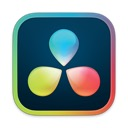</a>
<a href="../icons/DaisyDisk.icns">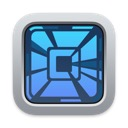</a>

<a href="../icons/Dash.icns">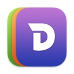</a>

<a href="../icons/Docker.icns">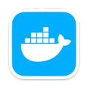</a>
<a href="../icons/Downie.icns">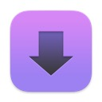</a>
<a href="../icons/Eagle.icns">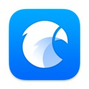</a>
<a href="../icons/Eclipse(1).icns">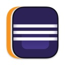</a>
<a href="../icons/Eclipse(2).icns">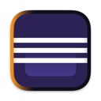</a>
<a href="../icons/Eclipse(3).icns">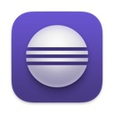</a>

<a href="../icons/KeyShot.icns">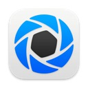</a>

<a href="../icons/Lemon.icns">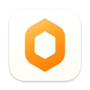</a>

<a href="../icons/MATLAB.icns">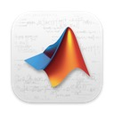</a>

<a href="../icons/MacDown.icns">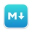</a>

<a href="../icons/MarkEditor_Dark.png">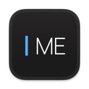</a>

<a href="../icons/MuMu.icns">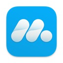</a>
<a href="../icons/Navicat.icns">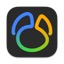</a>
<a href="../icons/NeteaseMusic.icns">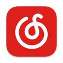</a>

<a href="../icons/Notion.icns">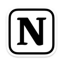</a>

<a href="../icons/PopClip.icns">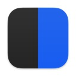</a>
<a href="../icons/Postman.icns">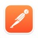</a>

<a href="../icons/Principle.icns">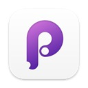</a>
<a href="../icons/QBlocker.icns">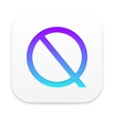</a>
<a href="../icons/QQ.icns">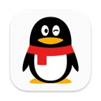</a>

<a href="../icons/Rectangle.icns">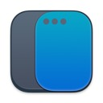</a>

<a href="../icons/Sketch.icns">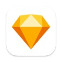</a>
<a href="../icons/SketchUP.icns">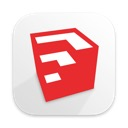</a>
<a href="../icons/Speedtest.icns">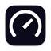</a>

<a href="../icons/Surge.icns">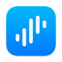</a>

<a href="../icons/Tampermonkey.icns">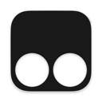</a>

<a href="../icons/Things3.icns">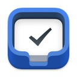</a>

<a href="../icons/Transmit.icns">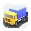</a>

<a href="../icons/XAMPP.icns">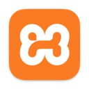</a>

<a href="../icons/Xnip.icns">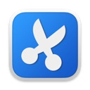</a>
<a href="../icons/cDock.icns">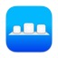</a>
<a href="../icons/checkra1n.icns">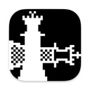</a>

