### 点击小图标可跳转至ICNS原图  /  Click on the thumbnail to access the ICNS file  
当前共有 [280] 个图标 / Here are [280] icons now  
****  

<a href="../icons/360安全云盘.icns">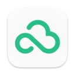</a>

<a href="../icons/App2Dmg.icns">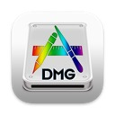</a>

<a href="../icons/BetterZip.icns">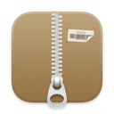</a>
<a href="../icons/BitBar.icns">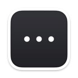</a>

<a href="../icons/Blocs.icns">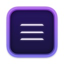</a>

<a href="../icons/CAD快速看图.icns">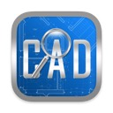</a>
<a href="../icons/CAJViewer.icns">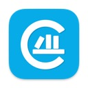</a>

<a href="../icons/CloverConfigurator.icns">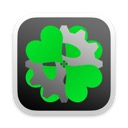</a>

<a href="../icons/CrossOver20.icns">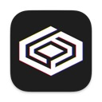</a>

<a href="../icons/DingTalk.icns">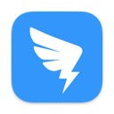</a>

<a href="../icons/Eclipse(1).icns">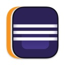</a>

<a href="../icons/FinalShell.icns">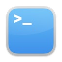</a>
<a href="../icons/FineReader.icns">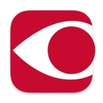</a>
<a href="../icons/FireStream.icns">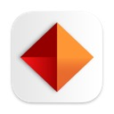</a>

<a href="../icons/FixEDID.icns">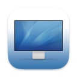</a>

<a href="../icons/FontForge.icns">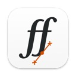</a>

<a href="../icons/Gemini.icns">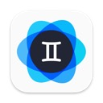</a>

<a href="../icons/GoodNote.icns">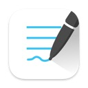</a>

<a href="../icons/Hackintool.icns">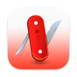</a>

<a href="../icons/MaciASL.icns">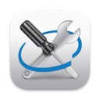</a>
<a href="../icons/Mactracker.icns">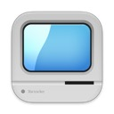</a>
<a href="../icons/MailMaster(网易邮箱大师).icns">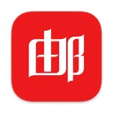</a>
<a href="../icons/MarkEditor.icns">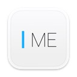</a>

<a href="../icons/Minecraft.icns">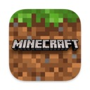</a>

<a href="../icons/MonitorFace.icns">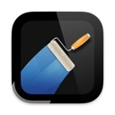</a>
<a href="../icons/Motrix.icns">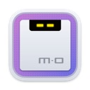</a>
<a href="../icons/Mounty.icns">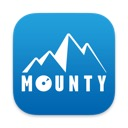</a>

<a href="../icons/MuMu.icns">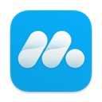</a>

<a href="../icons/NetNewsWire.icns">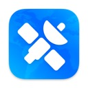</a>

<a href="../icons/NibViwer.icns">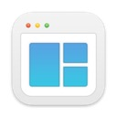</a>

<a href="../icons/Pacifist.icns">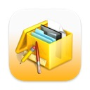</a>

<a href="../icons/QQ小程序开发者工具.icns">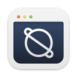</a>

<a href="../icons/RDM.icns">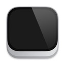</a>

<a href="../icons/START.icns">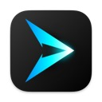</a>

<a href="../icons/Siri.icns">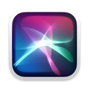</a>

<a href="../icons/Smooze.icns">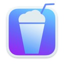</a>
<a href="../icons/Spark.icns">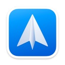</a>

<a href="../icons/ThemeEngine.icns">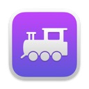</a>

<a href="../icons/Thunder.icns">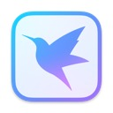</a>

<a href="../icons/UninstallPKG.icns">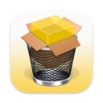</a>

<a href="../icons/WhatsApp.icns">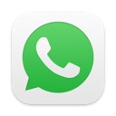</a>

<a href="../icons/XAMPP.icns">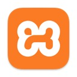</a>

<a href="../icons/XQuartz.icns">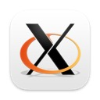</a>

<a href="../icons/Yoink.icns">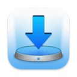</a>

<a href="../icons/balenaEtcher.icns">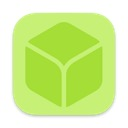</a>

<a href="../icons/iMazing.icns">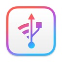</a>

<a href="../icons/miniQpicview(看图).icns">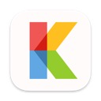</a>
<a href="../icons/pap.er.icns">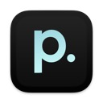</a>

<a href="../icons/wpsoffice.icns">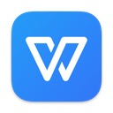</a>

<a href="../icons/即刻.icns">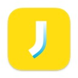</a>

